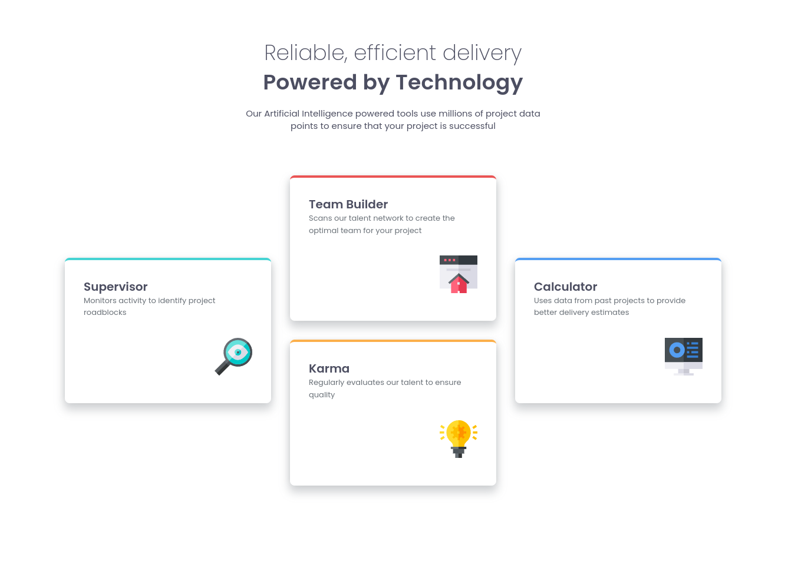

# Frontend Mentor - Four card feature section solution

This is a solution to the [Four card feature section challenge on Frontend Mentor](https://www.frontendmentor.io/challenges/four-card-feature-section-weK1eFYK). Frontend Mentor challenges help you improve your coding skills by building realistic projects. 

## Table of contents

- [Overview](#overview)
  - [The challenge](#the-challenge)
  - [Screenshot](#screenshot)
  - [Links](#links)
- [My process](#my-process)
  - [Built with](#built-with)
  - [What I learned](#what-i-learned)
  - [Continued development](#continued-development)
  - [Useful resources](#useful-resources)
- [Author](#author)

**Note: Delete this note and update the table of contents based on what sections you keep.**

## Overview

### The challenge

Users should be able to:

- View the optimal layout for the site depending on their device's screen size

### Screenshot



### Links

- Solution URL: [GitHub](https://github.com/ryanwells-rwc/four-card-feature-section)
- Live Site URL: [Netlify](https://four-card-feaeture-section-rwc.netlify.app/)

## My process

### Built with

- Semantic HTML5 markup
- Flexbox
- CSS Grid
- Mobile-first workflow

### What I learned

I learned a lot about using CSS Grid to create a responsive layout. I had to 
familiarize myself with the `grid-template-areas` property to create a complex layout with multiple columns and rows.

```css
main {
  grid-template-rows: repeat(4, 1fr);
  grid-template-columns: auto;
  grid-template-areas:
    ". item2 ."
    "item1 item2 item4"
    "item1 item3 item4"
    ". item3 .";
  gap: $size-400;
  margin-bottom: calc(163 / 16 * 1rem);

  article {
    width: 350px;
  }

  .cyan-top-border {
    grid-area: item1;
  }

  .red-top-border {
    grid-area: item2;
  }

  .orange-top-border {
    grid-area: item3;
  }

  .blue-top-border {
    grid-area: item4;
  }
}
```

### Continued development

In the future, I would like to manage the dimensions of the cards better 
when dynamically resizing the screen.

### Useful resources

- [CSS Grid](https://cssgrid.io/) - This course by Wes Bos is a great resource for learning CSS Grid.

## Author

- Website - [Ryan Wells](https://ryanwells.io)
- Frontend Mentor - [@ryanwells-rwc](https://www.frontendmentor.io/profile/ryanwells-rwc)
